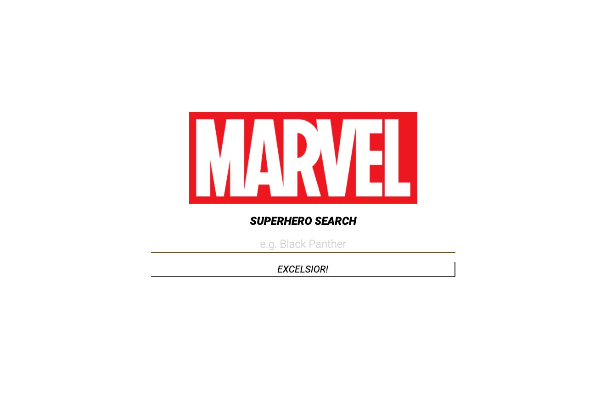
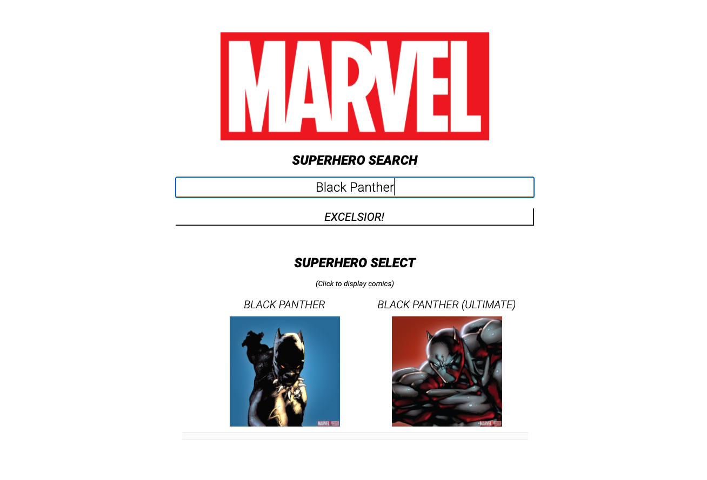
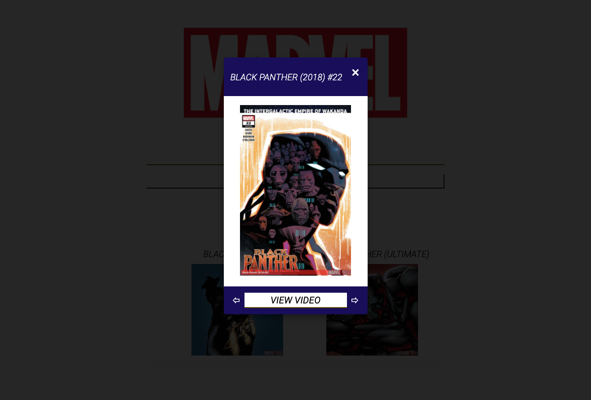
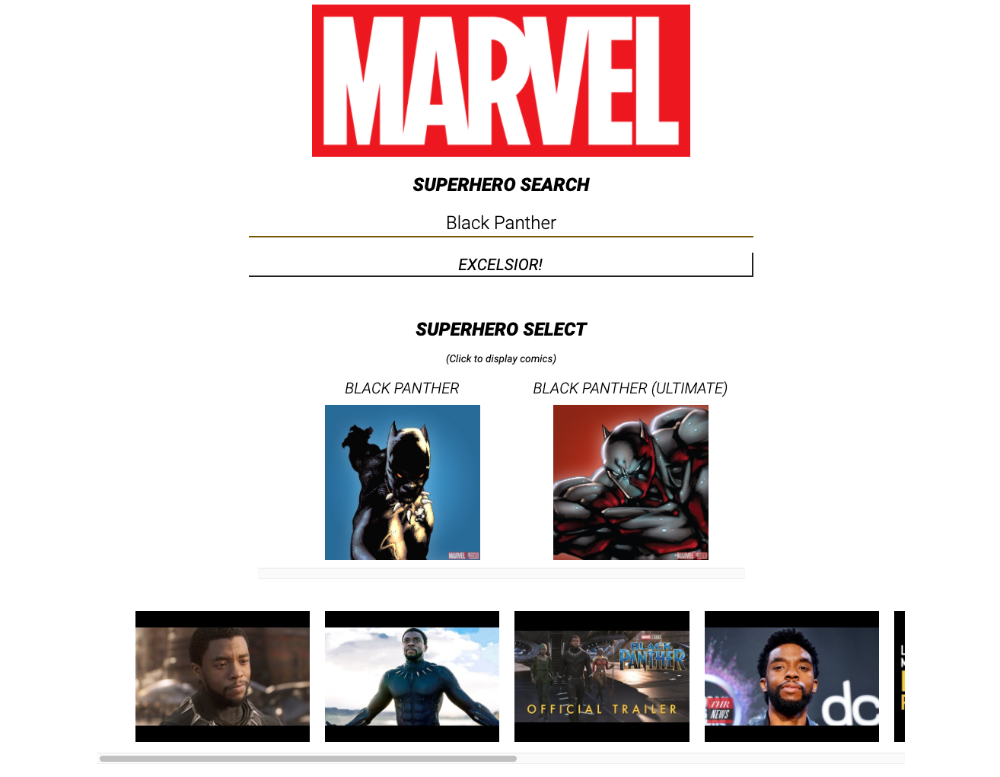

# Marvel Search API

## GitHub Pages Link:  https://mdotfal.github.io/marvel-api-mf/

## Screenshots
### Main Page/Landing Page

### Character Results

### Modal/ Comic Results

### Video Results

## Summary:

A user will be able to query a Marvel character by entering starting text and receive a list of list of characters that the text value started with.  When the user selects a character a modal will pop up showing a comic book title and will be able to arrow through a list of comics that the character appeared in.  When the user clicks the "View Videos" button, the modal will close and a list of video results will populate on the page.  When the user clicks the Marvel logo the results will clear and all stored values will reset to 0.

## Key Technologies Used
* HTML
* CSS
* JavaScript
* jQuery